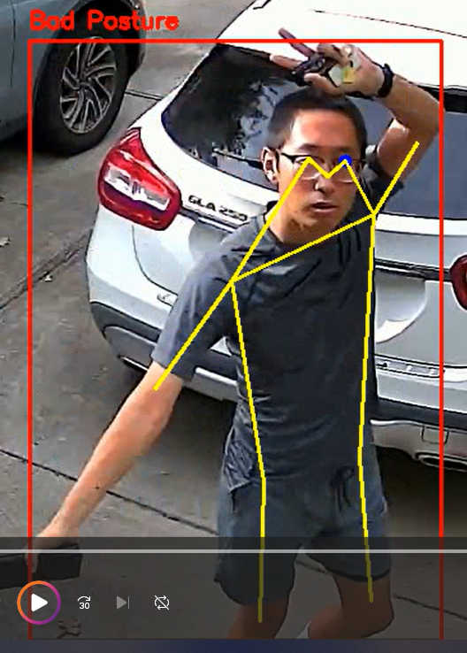

### **README: Human Activity Analysis with YOLOv8 and OpenCV**

## **Overview**

This Python script utilizes YOLOv8, OpenCV, and PyTorch to analyze human activities in a video. It detects human body parts in each frame and marks key points such as eyes, shoulders, hips, and elbows to analyze postures like sitting and standing. This tool can be used for activity recognition, ergonomic assessments, and posture monitoring in various settings.

## **Features**
- **Real-Time Human Detection**: Identifies humans in video frames using YOLOv8 pose estimation.
- **Keypoint Detection**: Marks critical body parts including eyes, shoulders, hips, elbows, and knees.
- **Posture Analysis**: Evaluates sitting and standing postures based on keypoint alignment and angles between body parts.
- **Angle Calculation**: Computes angles between ears, shoulders, and hips to assess posture quality.
- **Visual Feedback**: Draws bounding boxes and keypoint connections on frames to illustrate detected postures.

## **Dependencies**

The script requires the following libraries:
- **Python 3.8 or higher**
- **OpenCV**: For video capture and display.
- **PyTorch**: For running the YOLOv8 model.
- **Ultralytics YOLOv8**: For human detection and pose estimation.

### **Installation Guide**

1. **Clone the Repository**
   ```bash
   git clone https://github.com/breezedu/Human_Activity_Posture_Analysis.git
   cd Human_Activity_Posture_Analysis
   ```

2. **Install Python Dependencies**
   Make sure you have Python installed. Then, install the required packages:
   ```bash
   pip install -r requirements.txt
   ```

   Example `requirements.txt` file:
   ```
   opencv-python
   torch
   torchvision
   ultralytics
   numpy
   ```

3. **Download YOLOv8 Weights**
   The script uses YOLOv8 for pose estimation. Ensure you have downloaded the YOLOv8 model weights. You can download them using the Ultralytics package:
   ```bash
   yolo download --model yolov8s-pose.pt
   ```

4. **Run the Script**
   To run the script on your local camera or a video file:
   ```bash
   python human_activity_analysis.py
   ```

## **Usage Instructions**

1. **Running the Script**
   - Ensure your camera is connected, or provide the path to a video file within the script.
   - The script will start analyzing human postures frame-by-frame.

2. **Posture Analysis**
   - The script identifies keypoints such as eyes, shoulders, hips, elbows, and knees.
   - It calculates angles between keypoints to assess whether a person is sitting or standing.
   - Bounding boxes and lines between keypoints illustrate detected postures in real-time.
   
   i.e. Bad Postures:
   
   

    

   Good Postures: 

   

   

4. **Key Outputs**
   - **Bounding Boxes**: Highlight detected humans in each frame.
   - **Keypoints**: Mark specific body parts with colored dots.
   - **Posture Status**: Displays whether the detected person is sitting or standing.
   - **Angle Measurements**: Shows the calculated angles between ear-shoulder-hip to assess posture.

## **Example Screenshots**

- **Sitting Posture Detection**: Green bounding boxes and highlighted keypoints when sitting.
- **Standing Posture Detection**: Red bounding boxes and keypoints with posture status.

## **Troubleshooting**

- **YOLO Model Not Found**: Ensure the correct path to the YOLOv8 weights (`yolov8s-pose.pt`) is specified.
- **Insufficient Keypoints**: If not all keypoints are detected, the script will skip analysis for that frame.
- **Slow Performance**: Ensure GPU support is enabled. Install the appropriate PyTorch version for CUDA.

## **Customization**

- **Adjust Detection Sensitivity**: Modify the YOLOv8 confidence threshold within the script to filter detections.
- **Change Keypoints of Interest**: Edit keypoint indices to focus on specific body parts relevant to your use case.
- **Extend Posture Analysis**: Add custom rules to analyze additional postures like leaning or squatting.

## **References**

- **Ultralytics YOLOv8 Documentation**: [https://docs.ultralytics.com](https://docs.ultralytics.com)
- **OpenCV Documentation**: [https://docs.opencv.org](https://docs.opencv.org)
- **PyTorch Documentation**: [https://pytorch.org/docs](https://pytorch.org/docs)

## **License**

This project is licensed under the MIT License. See the LICENSE file for more details.

---

Feel free to pull or fork this repo, hope this tiny project could give us some hints on other ideas!
